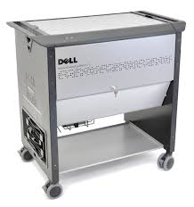
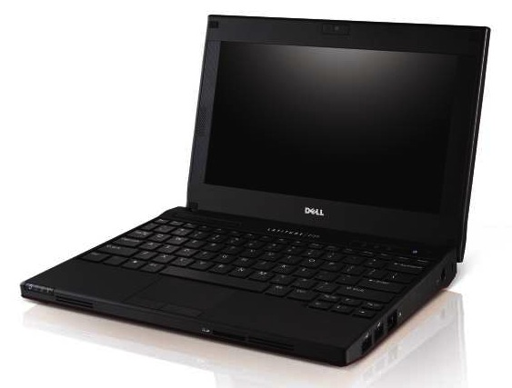

# Dell Latitude 2120 Docker Swarm Cluster

## Objective

The goal of this project is to use an old Dell Latitude 2120 school cart that houses 24 Dell Latitude 2120 Netbooks, from the 2010's, and create a [Docker Swarm Cluster](https://docs.docker.com/engine/swarm/) with them.

## Hardware

Here is the spec sheet on the [Dell Latitude 2120 Netbooks](./images/latitude-2120-specsheet.pdf) and the optional cart. Each of the machines has the following harware configuration:
- 1 x 2 GB 1DIMM DDR3 SDRAM (667MHz)
- 1 x 5400rpm SATA 250 GB HD

## Machine Setup

Each machine has the exact same identical initial setup:
- Debian 13 - Trixie, server no GUI and slim nothing extra loaded
- BIOS upgraded to A02
  - BIOS power setting changed to on "power restart" the computer automatically reboots
- additional software installed:
  - openssh-server (apt install openssh-server)
  - [docker](https://docs.docker.com/engine/install/debian/)

The following setting have been changed, as root, on each machine:
- nano /etc/systemd/logind.conf
  - [Login]
    HandleLidSwitch=ignore
    HandleLidSwitchExternalPower=ignore
    HandleLidSwitchDocked=ignore
- nano /etc/resolv.conf
  - nameserver 10.100.204.1
- nano /etc/network/interfaces
  - allow-hotplug enp9s0
    iface enp9s0 inet static
    address 10.100.204.150
    netmask 255.255.255.0
    gateway 10.100.204.1
    dns-nameservers 10.100.204.1

## Image and Cloning

Once the 1st machine is setup and test it needs to be cloned to the rest:
- download [Rescuezilla](https://github.com/rescuezilla/rescuezilla)
- burn the iso to USB drive
- have 2nd USB to save the image onto
- boot from Rescuezilla, clone image
- take each other machine, boot from Rescuezilla and burn saved image onto new machine
- once done and each new machine is rebooted change the following:
  - nano /etc/network/interfaces
    - the IP address to next in series
  - nano /etc/hostname
    - the hostname to next in series
  - ensure each machine also on A02 BIOS and "power" on setting updated in BIOS